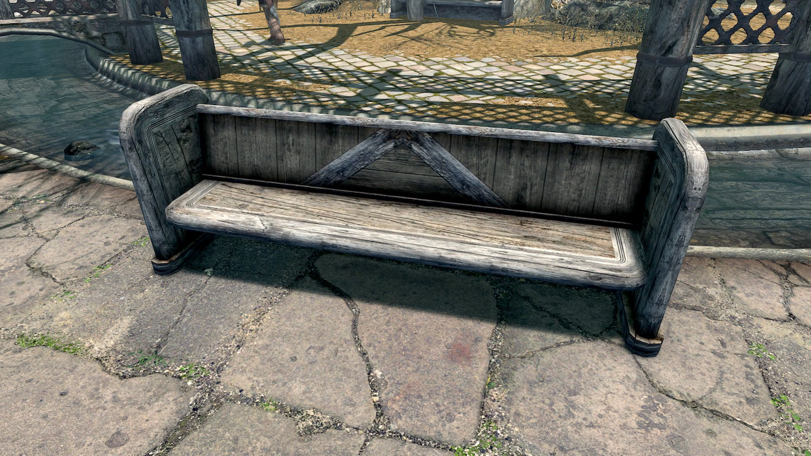
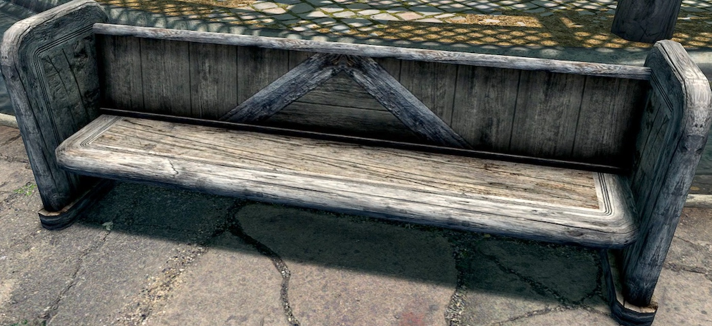
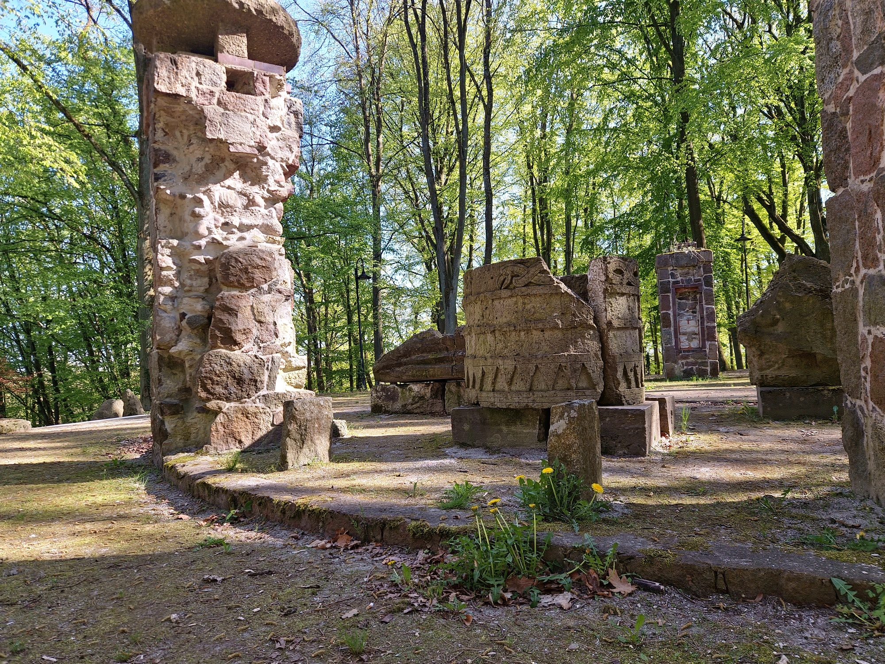
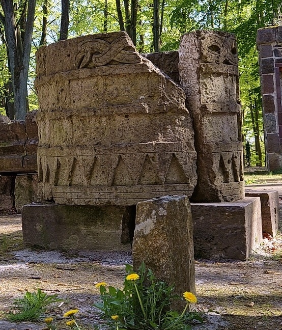
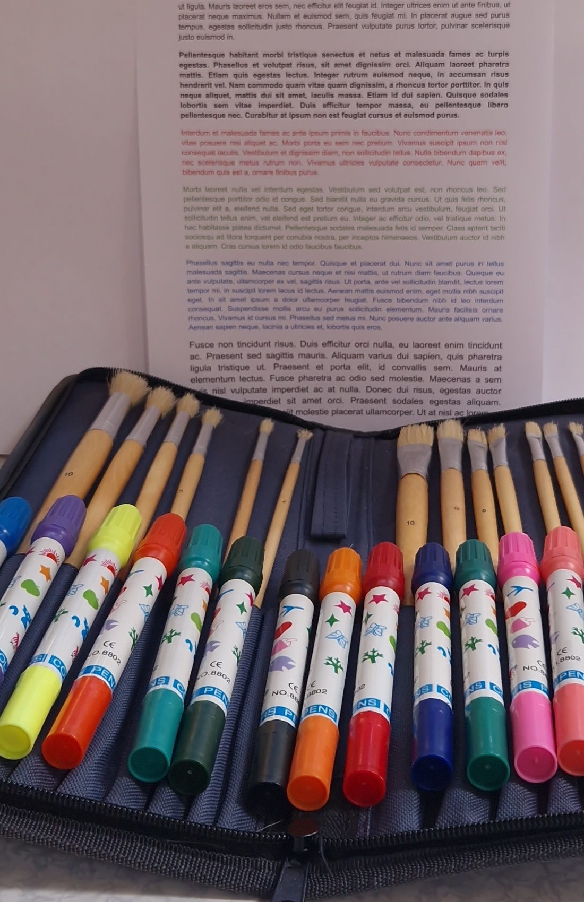
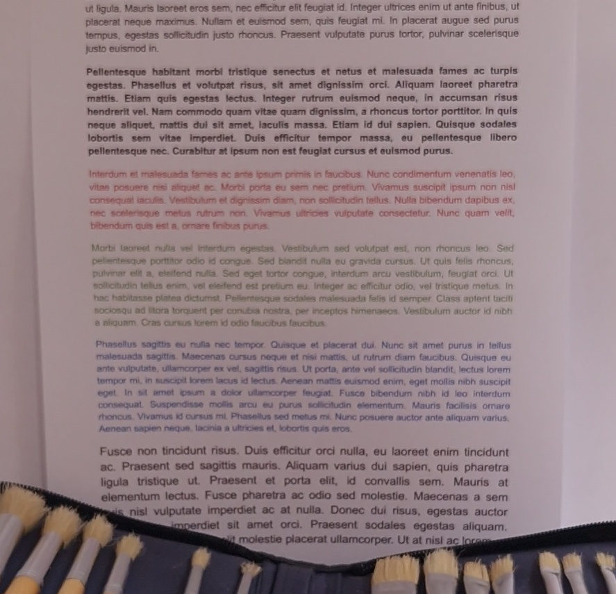

# About:  
Locally used image and video detection program. Images and videos can be scanned for any object so that they will be cropped by the program and detections copied to output folder.  
Main features of this program: image/video detection of any class with cropping, automatic trimming and merging of video clips, efficient video processing (can do detection in less time than video duration and doesn't require 100+GB of RAM).  
Default AI model for detection is "yoloe-11m-seg-pf.pt" or "yoloe-11m-seg.pt" depending on whether user specifies target text prompt.  
When scanning images, each one is processed by AI model and if detection confidence is above threshold then image will be cropped to bounding box of detection and saved to output folder. Program will also save mask of the object detected with highest confidence.  
Scanning videos is similar to images, but the difference is that only every N-th frame is processed and resulting videos are merged from clips of detections. Also masks are not created for videos.  
Supported input file types are: .jpg, .png, .mp4, .mkv

# Installation:  
Use those commands to download program from github and install dependencies in virtual environment:  
1. clone program's repository and go to main folder  
   ```console
   git clone https://github.com/Krzysztof-Bogunia/im-vid-detector.git
   cd im-vid-detector
    ```
2. create venv  
    ```console
   python -m venv .venv
    ```
3. activate venv (for fish shell)*  
   ```console
   source .venv/bin/activate.fish
    ```
4. download pytorch (with cuda 12.9)  
   ```console
   pip install torch torchvision --index-url https://download.pytorch.org/whl/cu129
    ```
5. install the rest of dependencies  
   ```console
   pip install -r requirements.txt
    ```  
DONE
* after program is installed only step 3 is required to activate environment and run it  

# Examples: 
1. Scanning image for any object with exact crop to detection:  
```console
python im-vid-detector.py --input ./examples/images/image0.jpg --crop_offset 0.0
```
|     BEFORE      |      AFTER     |
| :-------------: | :------------: |
|   |  |  

2. Scanning all images for "statue,monument,brick building,brickwork". Threshold for prompt detection often needs to be much lower than in prompt-less detection (especially for unusual objects):  
```console
python im-vid-detector.py --input ./examples/images/ --prompt "statue,monument" --threshold 0.02
```
|     BEFORE      |      AFTER     |
| :-------------: | :------------: |
|   |  |  

3. Scanning all images for "document".
```console
python im-vid-detector.py --input ./examples/images/ --prompt "document" --threshold 0.05
```
|     BEFORE      |      AFTER     |
| :-------------: | :------------: |
|   |  | 

4. Scanning all videos for "sword,magic weapon,medieval sword":  
```console
python im-vid-detector.py --input ./examples/videos/ --prompt "sword,magic weapon,medieval sword" --crop 1 --threshold 0.05 --crop_offset 0.02 --frame_skip 2 --model yoloe-11l-seg.pt
```
|     BEFORE      |

https://github.com/user-attachments/assets/23563fab-8639-477d-85ac-64a7c2f8f1b7

|      AFTER     |


https://github.com/user-attachments/assets/613effc8-d2d1-406c-936a-8778a215cdbd


For prompt keywords check this list of predefined classes [classes](https://github.com/xinyu1205/recognize-anything/blob/main/ram/data/ram_tag_list.txt)
