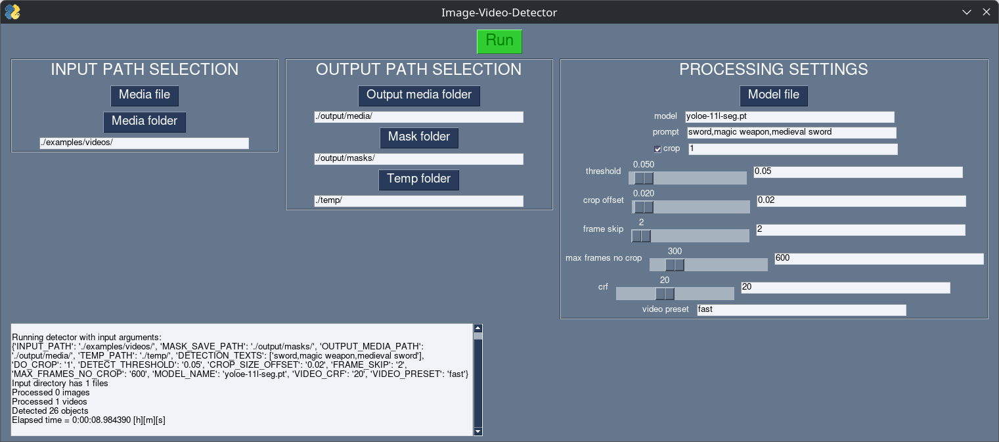
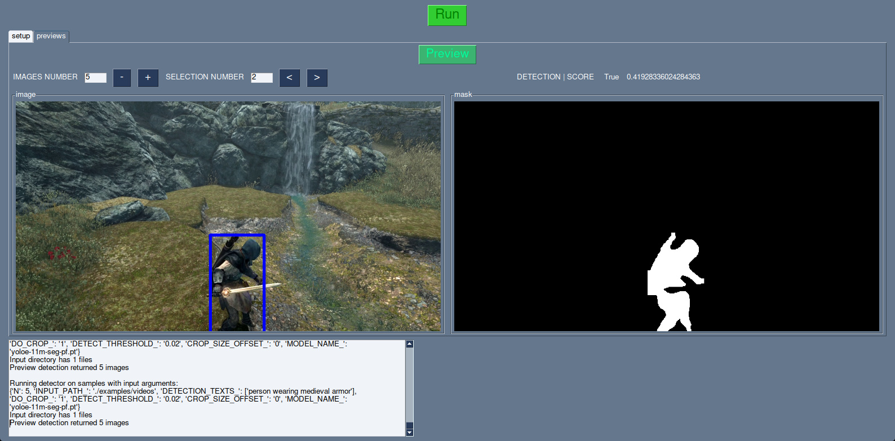
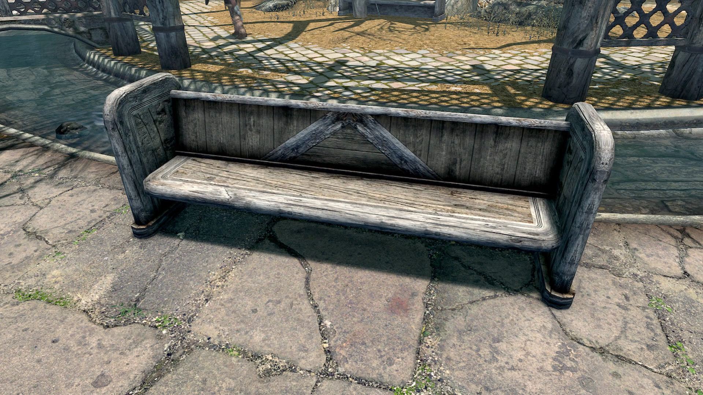
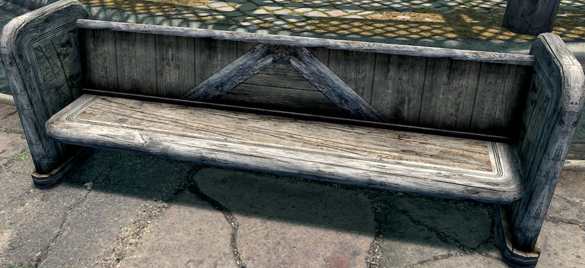
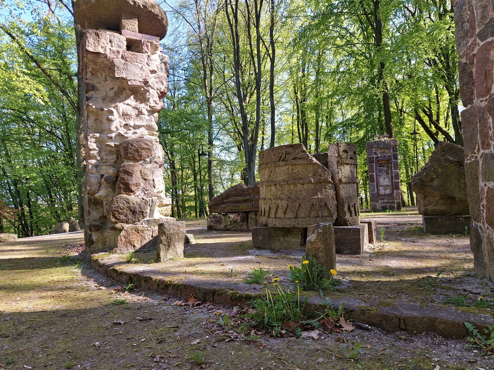
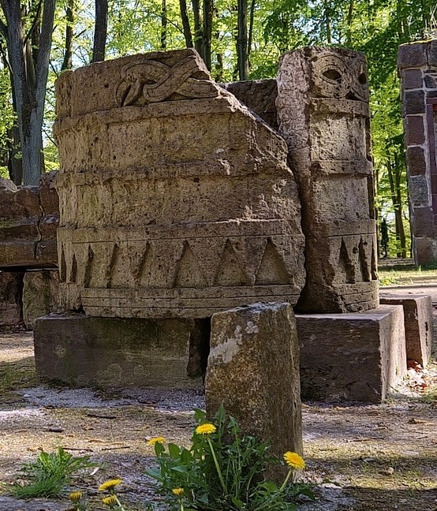
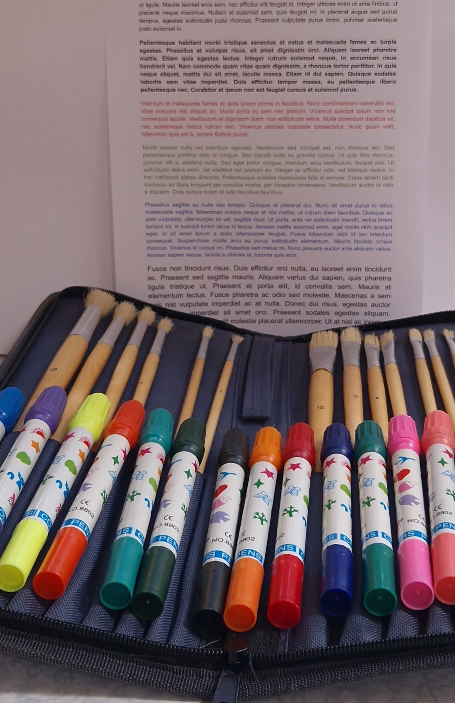
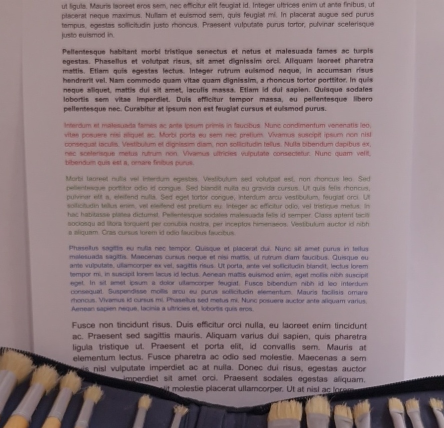

# About:  
Locally used image and video detection program. Images and videos can be scanned for any object so that they will be cropped by the program and detections copied to output folder.  

## Main features of this program:  
- image/video detection of any class with cropping to bounding box  
- automatic trimming and merging of video clips  
- efficient video processing (can do detection in less time than video duration and doesn't require 100+GB of RAM).  

Default AI model for detection is "yoloe-11m-seg-pf.pt" or "yoloe-11m-seg.pt" depending on whether user specifies target text prompt.  
When scanning images, each one is processed by AI model and if detection confidence is above threshold then image will be cropped to bounding box of detection and saved to output folder. Program will also save mask of the object detected with highest confidence.  
Scanning videos is similar to images, but the difference is that only every N-th frame is processed and resulting videos are merged from clips of detections. Also masks are not created for videos.  
Supported input file types are: .jpg, .png, .mp4, .mkv

# Installation:  
## Windows only steps - setup WSL first, then [continue](#Installation-inside-venv) with the installation inside venv
1. If WSL is not installed then install it according to [instructions](https://learn.microsoft.com/en-us/windows/wsl/install) and reboot computer.  
2. Launch WSL.  
3. Update Ubuntu system inside WSL and install python tools and ffmpeg  
```console
sudo apt update && sudo apt upgrade -y && sudo apt install git ffmpeg python3-venv python-is-python3 python3-tk -y
```
4. [optionally] run command to open file explorer inside WSL directory.  
```console
explorer.exe .
```  

## Ubuntu only steps - setup system first, then [continue](#Installation-inside-venv) with the installation inside venv
Update Ubuntu system and install python tools and ffmpeg  
```console  
sudo apt update && sudo apt upgrade -y && sudo apt install git ffmpeg python3-venv python-is-python3 python3-tk -y
```  

## Installation inside venv
Use those commands to download program from github and install dependencies in virtual environment:  
1. clone program repository and go to main folder  
```console
git clone https://github.com/Krzysztof-Bogunia/im-vid-detector.git && cd im-vid-detector
```
2. create venv in current directory  
```console
python -m venv .venv
```
3. activate venv (choose depending on platform, by default "a")  
    a. **Linux (default bash shell)**    
    ```console
    source .venv/bin/activate
    ```  
    b. Linux (fish shell)   
    ```console
    source .venv/bin/activate.fish
    ```
4. download pytorch (with cuda 12.9 - other versions may work too)  
```console
pip install torch torchvision --index-url https://download.pytorch.org/whl/cu129
```
5. install the rest of dependencies  
```console
pip install -r requirements.txt
```  

DONE
* after everything is installed only step 3 can be required in normal program usage to activate the environment and run the program  

# Program usage: 
## Default options:  
usage: im_vid_detector.py [-h] [--input INPUT] [--masks MASKS] [--output_media OUTPUT_MEDIA] [--temp TEMP] [--prompt PROMPT]
                          [--threshold THRESHOLD] [--crop_offset CROP_OFFSET] [--frame_skip FRAME_SKIP] [--model MODEL]
                          [--max_frames_no_crop MAX_FRAMES_NO_CROP] [--crf CRF] [--video_preset VIDEO_PRESET]  

Image and video detector. Program can scan all media in folder using AI model and return only those that match specified target.
Processing is done locally.  

options:  
  **-h, --help**            
                        show this help message and exit  
  **--input INPUT**         
                        input media path. Default value: ./input/  
  **--masks MASKS**         
                        output masks path. Default value: ./output/masks/  
  **--output_media OUTPUT_MEDIA**  
                        output processed media path. Default value: ./output/media/  
  **--temp TEMP**           
                        output temporary media path (*CAN BE AUTOMATICALLY DELETED!*). Default value: ./temp/  
  **--prompt PROMPT**       
                        target text description. Default value is empty so model should detect most likely class in input image  
    **--crop CROP**           
                        whether to crop input images to size matching bounding box of detection {0;1}. Default value: 1  
  **--threshold THRESHOLD**  
                        detection confidence threshold <0; 1>. Default value: 0.7  
  **--crop_offset CROP_OFFSET**  
                        detection bounding box crop size offset. Controls whether to crop input images to size matching bounding box of detection. Value is ratio of image size <-1; 1>. Default value: 0.04  
  **--frame_skip FRAME_SKIP**  
                        how many video frames to skip in each iteration of detection. Default value: 30  
  **--model MODEL**     
                        name of the model for detection. Default value: yoloe-11m-seg-pf.pt (without text prompt) or
                        yoloe-11m-seg.pt (with text prompt)  
  **--max_frames_no_crop MAX_FRAMES_NO_CROP**  
                        maximum number of video frames before cutting video and applying different crop. Default value: max(FRAME_SKIP*10, 48)  
  **--crf CRF**          
                        ffmpeg argument for quality of output video (best quality is VIDEO_CRF=0). Default value: 23  
  **--video_preset VIDEO_PRESET**  
                        ffmpeg argument for encoding preset of output video. Default value: superfast  

## Examples:
The following examples assume that user is in main program directory.  
### Graphical interface  
Start program by double clicking on **run_gui.sh** or open console and run the following command  
```console
./run_gui.sh
```
Example video processing 
  

Example video detection preview 


### CLI  
If venv is not currently activated then activate as shown in installation step 3 [instructions](#Installation-inside-venv).  

1. Scanning image for any object with exact crop to detection:  
```console
python im_vid_detector.py --input ./examples/images/image0.jpg --crop_offset 0.0
```
|     BEFORE      |      AFTER     |
| :-------------: | :------------: |
|   |  |  

2. Scanning all images for "statue,monument,brick building,brickwork". Threshold for prompt detection often needs to be much lower than in prompt-less detection (especially for unusual objects):  
```console
python im_vid_detector.py --input ./examples/images/ --prompt "statue,monument" --threshold 0.02
```
|     BEFORE      |      AFTER     |
| :-------------: | :------------: |
|   |  |  

3. Scanning all images for "document".
```console
python im_vid_detector.py --input ./examples/images/ --prompt "document" --threshold 0.05
```
|     BEFORE      |      AFTER     |
| :-------------: | :------------: |
|   |  | 

4. Scanning all videos for "sword,magic weapon,medieval sword" with additional parameters:  
```console
python im_vid_detector.py --input ./examples/videos/ --prompt "sword,magic weapon,medieval sword" --threshold 0.05 --crop_offset 0.02 --model yoloe-11l-seg.pt --frame_skip 2 --max_frames_no_crop 600 --crf 20 --video_preset superfast
```
|     BEFORE      |

https://github.com/user-attachments/assets/23563fab-8639-477d-85ac-64a7c2f8f1b7

|      AFTER     |


https://github.com/user-attachments/assets/613effc8-d2d1-406c-936a-8778a215cdbd


For prompt keywords check this list of predefined classes [classes](https://github.com/xinyu1205/recognize-anything/blob/main/ram/data/ram_tag_list.txt)  

# License:  
Scripts and assets in this project are licensed under the MIT license.  
Third-Party components that are installed separately may require getting addional license for commercial use. AI models are not part of this repositoy and need to be provided by the user or automatically downloaded. See [ultralytics license](https://www.ultralytics.com/license) for more information.  
